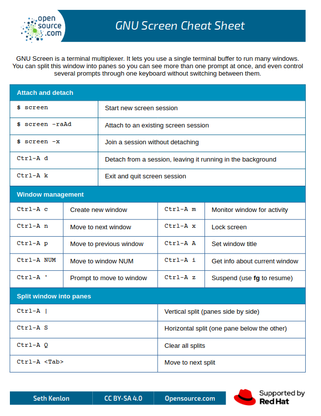

# Remote Computing & File Transfers 

## Learning Objectives

By the end of this section, you should be able to:

* Connect to remote systems with SSH
* Configure key-based SSH authentication
* Transfer files efficiently with `rsync`
* Run long jobs safely using background tools and schedulers
* Understand the core fields in a SLURM submission script

#### Secure remote access with ssh

One of the reasons researchers use Linux is because it is easy to allow users to remotely connect to a server in a secure manner, using `ssh`. Below is how you would connect using a *Linux* or *Mac OSX* computer using a TERMINAL program. Both of these operating systems should have a terminal installed by default.

```bash
ssh yournetidhere@pronghorn.rc.unr.edu 
```

If this is your first time connecting to the server, you may need to accept connecting to the remote server by typing "yes". 

```bash
The authenticity of host 'pronghorn.rc.unr.edu (134.197.76.4)' can't be established.
ED25519 key fingerprint is SHA256:QAFX5eUaSvFi3/+IRuP6Zm8RM6OcGRZb5vySBgq/yZ4.
This key is not known by any other names
Are you sure you want to continue connecting (yes/no/[fingerprint])? Yes
```

You will then be prompted to type in your netid password. As you type, the cursor will not move/display text in order to keep your password secure. An alternative terminal that I like on OSX is [iTerm](https://iterm2.com/).

*Windows* does not have `ssh` functionality built into the system. You will need to setup a program in order to remotely connect to Pronghorn. You can enable WSL using this [tutorial from Microsoft](https://learn.microsoft.com/en-us/windows/wsl/install). Once installed, you will configure the connection information similar to above.

#### Efficient file transfer with rsync

`rsync` (Remote Sync) is a powerful and efficient file-copying tool used in Unix/Linux systems. It allows fast, incremental file transfers between local and remote systems while minimizing data transfer by copying only the differences between source and destination files. It is commonly used for backups, mirroring, and synchronization.

* Fast & Efficient – Transfers only modified parts of files.
* Preserves File Attributes – Retains timestamps, permissions, and symbolic links.
* Supports SSH for Secure Transfers – Encrypts data over networks.
* Incremental Backup – Copies only changed files to save bandwidth.
* Can Work Locally or Remotely – Syncs files between directories or different systems.

The basic syntax is as follows:

```bash
rsync [OPTIONS] SOURCE DESTINATION
```

Now for some examples. In the next example, we backup file.txt to /backup/ directory with the -a and -v options. `-a` enables Archive Mode which preserves timestamps, permissions, symbolic links, etc. `-v` enables verbose mode so that we can show the details of the file transfer.

!!! warning "Do Not Execute"
    Since we do not want to dramatically increase the storage on your local laptops/workstations, the following examples are for reference and **should not be run**.

    ```bash
    rsync -av file.txt /backup/
    ```

In the next example, we backup the contents of the `docs/` directory in the user home folder to a `/backup/docs/` folder.

!!! tip "Mind the Trailing Slash"
    The trailing slash (`/`) is incredibly important in `rsync`:
    
    * `/docs/` → Syncs the *contents* of docs to `/backup/docs/`.
    * `/docs` → Syncs the *entire docs directory itself* inside `/backup/`.

    ```bash
    rsync -av /home/user/docs/ /backup/docs/
    ```

Now, for copying data from a remote server, we could use the following command. The string `user@remote_server:/backup/docs/` tells rsync where the data is on the remote server with the remote connection string, and the second portion tells rsync where to copy the data to the local computer.

```bash
rsync -av user@remote_server:/backup/docs/ /home/user/docs/
```

Likewise, we can copy data from the local computer and send it to a remote server.

```bash
rsync -av  /home/user/docs/ user@remote_server:/backup/docs/
```

Lastly, we can tell rsync to delete files that are not present in the destination folder when they are not present in the source folder.

!!! danger "Data Loss Warning"
    **THERE IS NO RECOVERING DATA FROM THE DELETE COMMAND.** Always run a `--dry-run` which simulates the command and shows you what *would* happen without actually making changes.

    ```bash
    rsync -av --delete --dry-run /home/user/docs/ user@remote_server:/backup/docs/
    ```

Additionally, you can have a list of file types you want it to exclude.

```bash
rsync -av --exclude "*.log" --exclude "tmp/" /home/user/docs/ user@remote_server:/backup/docs/
```

If you are limited by bandwidth, you can speed up the transfer by using the `-z` option to compress the data during transfer.

```bash
rsync -avz --exclude "*.log" --exclude "tmp/" /home/user/docs/ user@remote_server:/backup/docs/
```

`rsync` is an essential tool for file synchronization, backups, and mirroring between local and remote systems. It is fast, efficient, and secure, making it a great alternative to scp or cp for large file transfers.

#### Running in the Background

Sometimes it’s useful to continue working on the command line, even after you’ve executed a command that’s going to take a while to finish. Normally this command would occupy the shell, and prevent you from typing in commands and receiving results. But we can ‘put jobs in the background’ so that they don’t occupy your shell directly:

```bash
(base) [user@login-0 testdata1]$  sleep 1000000
```

`Ctrl-Z` to pause (stop) the command

```bash
(base) [user@login-0 testdata1]$  bg
```

To restart the last command in the background. ‘^Z’ first suspends the sleep command. Then, ‘bg’ resumes running that command in the background, so that it doesn’t occupy the terminal. The output of the ‘bg’ command tells you that you have one command running in the background. You could start more, suspend them, then resume them in the background, and query what background jobs are running or are suspended, not running:

```bash
(base) [user@login-0 testdata1]$  jobs
[1]+  Running                 sleep 1000000 &
``` 

We can also start a job in the background in one step, without having to suspend then resume it, using the ‘&’ character at the end of the command:

```bash
(base) [user@login-0 testdata1]$  sleep 5000000 &
```

If we want to delete these jobs for any reason, we can kill them using the numbering that ‘jobs’ reveals:

```bash
(base) [user@login-0 testdata1]$  jobs
[1]-  Running                 sleep 1000000 &
[2]+  Running                 sleep 5000000 &

(base) [user@login-0 testdata1]$  kill %1
(base) [user@login-0 testdata1]$  jobs
[1]-  Terminated              sleep 1000000
[2]+  Running                 sleep 5000000 &

(base) [user@login-0 testdata1]$   kill %2
(base) [user@login-0 testdata1]$   jobs
[2]+  Terminated              sleep 5000000
```

Finally, the ‘nohup’ command (from ‘no hangup’!) makes jobs extra resistant to lost connections or terminal problems. In other words, even jobs running in the background can be terminated if one’s shell dies. ‘nohup’ separates the running job from the shell, so it’ll keep running until it dies or is actively killed by you.

```bash
(base) [user@login-0 testdata1]$  nohup sleep 1000000 &
[1] 34993

(base) [user@login-0 testdata1]$   jobs
[1]+  Running                 nohup sleep 1000000 &
```

Output is dumped into the ‘nohup.out’ file unless specifically redirected in your command. If you used bg to send a process to the background you can use ‘disown’ to “nohup” the process.

#### Transitioning to HPC Schedulers (SLURM & PBS)

While tools like `nohup` and `bg` are great for long-running scripts, they have a major limitation on shared remote servers (like Pronghorn). When you log in via SSH, you land on a "login node" or "head node." This node is meant for moving files, editing scripts, and compiling code, not for heavy data processing. If everyone ran their `nohup` jobs on the login node, the server would quickly crash.

Instead, High-Performance Computing (HPC) clusters use **Job Schedulers**, primarily **SLURM** (Simple Linux Utility for Resource Management) or **PBS** (Portable Batch System). Pronghorn uses **SLURM**.

Schedulers act as a traffic cop. Instead of running a script directly, you write a wrapper script that asks the scheduler for resources (e.g., "I need 4 CPU cores and 16GB of RAM for 2 hours"), and the scheduler places your job in a queue to run on a dedicated "compute node."

Here is what our `filelist_linecounter.sh` script might look like wrapped in a basic SLURM `sbatch` submission script:

```bash
#!/bin/bash
#SBATCH --job-name=line_counter
#SBATCH --nodes=1
#SBATCH --ntasks=1
#SBATCH --cpus-per-task=4
#SBATCH --mem=8G
#SBATCH --time=02:00:00
#SBATCH --output=line_counter_%j.out
#SBATCH --error=line_counter_%j.err

# Load any necessary modules or activate conda environments here
# source activate my_env

# Run our custom script
~/bin/filelist_linecounter.sh files.txt
```

!!! tip "Batch vs. Interactive"
    You submit the script above using `sbatch myscript.sh` (or `qsub` for PBS). The scheduler will run it in the background as soon as resources are available, completely replacing the need for `nohup`.

#### SLURM Script Anatomy

Common directives in the example script:

* `--job-name`: label shown in scheduler queues
* `--cpus-per-task`: CPU cores requested for one task
* `--mem`: memory requested (for example, `8G`)
* `--time`: walltime limit in `HH:MM:SS`
* `--output` and `--error`: log files for STDOUT and STDERR

Use realistic values. Over-requesting resources can delay queue start time.

#### Using screen command

This section will show you how to configure and use screen.

When you connect to a remote server via ssh/PUTTY, you are presented one window to do all your work. However, there are times where you may be editing a file and want to look up a file path/location in order to configure it within your script you are writing. In order to enable this, you can use the `screen` command. Screen will create virtual windows on the remote system so you can perform multiple actions at the same time.

First, we need to download a screen configuration file in our home directory called ".screenrc".  I have one hosted on our core's github page here: [https://raw.githubusercontent.com/Nevada-Bioinformatics-Center/unix_configurations/main/.screenrc](https://raw.githubusercontent.com/Nevada-Bioinformatics-Center/unix_configurations/main/.screenrc)

This configuration file sets up how the windows will be displayed when you use screen. Use `wget` to download this file to your home directory:

```bash
(base) user@node:~$ wget [https://raw.githubusercontent.com/Nevada-Bioinformatics-Center/unix_configurations/main/.screenrc](https://raw.githubusercontent.com/Nevada-Bioinformatics-Center/unix_configurations/main/.screenrc)
```

Now that we have the configuration file, let's start a session:

```bash
(base) [user@login-0 testdata1]$  screen
```

Now that you are running screen, you will see the bottom portion of your terminal has some new text. In green towards the bottom left of your screen, you have the hostname of the computer you are on. Next to this you have your virtual windows numbered from 0 to N. By default right after you run screen, you will have 1 named window as `(0*$bash)`.

Let's create a new screen window by pressing the `CTRL+A` keys together. These two keys together tells the server that the next key that is pressed will be a screen command. 

Press the "c" key after you press `CTRL+A` keys. This will create a new window labeled `(1*$bash)`. You can then switch between these virtual windows by pressing the `CTRL+A` keys together then typing the number of the window you want to view.

When you are finished working, you can close your terminal to end your session. Then, the next day you want to work on the project you can SSH to Pronghorn and then issue the `screen -x` command to restore your previous screen session. Pretty Nifty!

!!! info "Alternative: tmux"
    You might also hear about a newer tool called `tmux` (Terminal Multiplexer). It does the exact same core job as `screen` but offers more advanced features like split-panes and deep scriptability. While power users often prefer `tmux`, we focus on `screen` in this workshop because it is the universally available workhorse, it comes pre-installed on practically every Linux server and HPC cluster you will ever encounter.

### Screen Cheat Sheet



## Troubleshooting: SSH, rsync, and Scheduler Errors

* **SSH hangs or times out**: run `ssh -v user@host` to inspect connection details.
* **Permission denied (publickey)**: verify key is in `~/.ssh/authorized_keys` and permissions are strict (`chmod 700 ~/.ssh`, `chmod 600 ~/.ssh/authorized_keys`).
* **`rsync` copied unexpected folder nesting**: re-check trailing slash behavior on source path.
* **SLURM job pending too long**: inspect queue and requested resources with `squeue -u $USER`.
